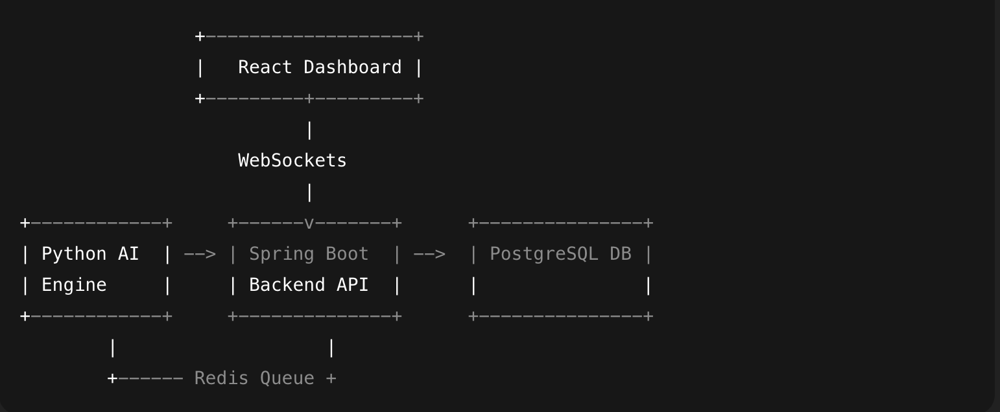
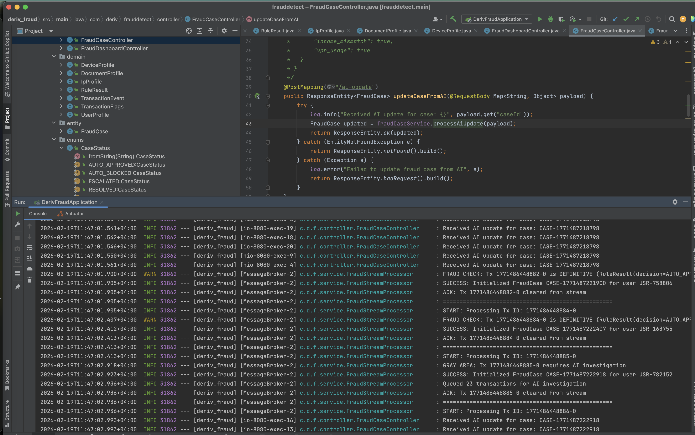
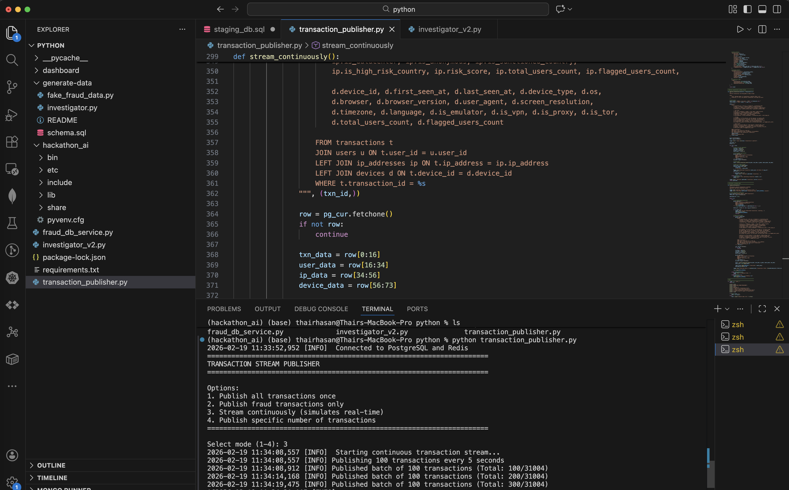
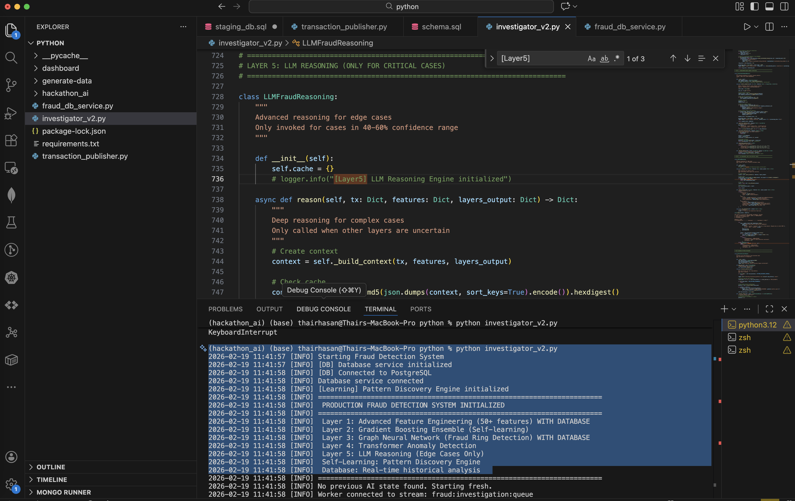
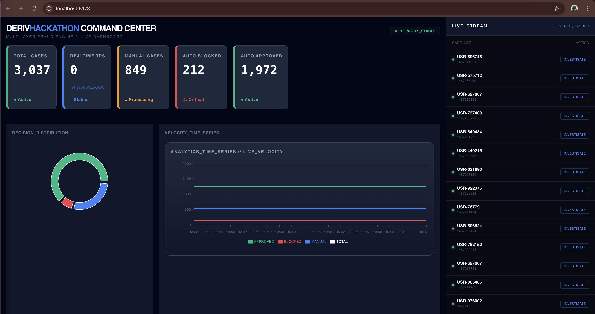
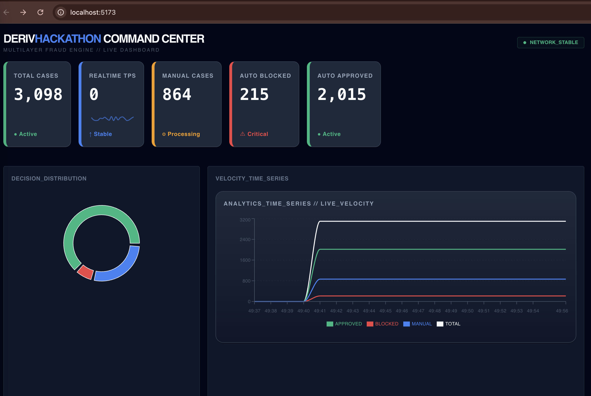
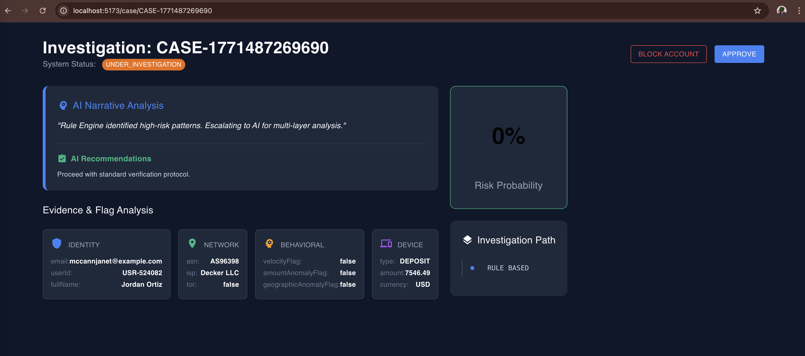

# 🧠 Neural Fraud Detection Engine with help of AI chat models for code building

> A high-performance backend system that analyzes transactional data in real time using machine learning to detect fraudulent behavior and provide actionable insights for forensic investigators.

---

## 📸 System Overview



java BE


Python publisher



Python Investigator



Dashboard




---

## 🚀 Features

### ⚡ Real-Time Analytics
- WebSocket-driven live feed of incoming fraud cases
- Instant transaction risk updates

### 🤖 AI Narrative Analysis
- Automated behavioral summaries
- Detection of anomaly patterns
- Risk probability scoring

### 🗂 Case Management
- Approve / Block workflow
- Risk-based transaction decisions
- Investigator audit trail

### 🖥 Command Center Dashboard
- High-density SOC interface
- Real-time fraud metrics
- Case drill-down analysis

---

## 🏗 Architecture Overview


## 🛠 Technology Stack

### Backend
- Java 17+
- Spring Boot

### Database
- PostgreSQL

### Real-Time Communication
- WebSockets
- Redis (Message Queue)

### AI Module
- Python (Fraud scoring + anomaly detection)

### Frontend
- React
- Material-UI
- Recharts

## 📦 Getting Started

### 1️⃣ Clone the Repository

```bash
git clone https://github.com/yourusername/fraud-detection-engine.git
cd fraud-detection-engine
